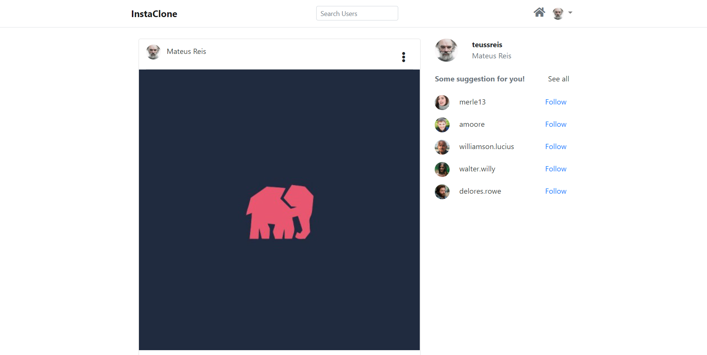

# instaClone



## Description
---

This project is a clone of the instagram, built with laravel 8 and livewire, which reproduce the instagram's layout, as also, some of its main functionalities!

## Main Features
---
- Create a post
- Create post
- Delete post
- Like and dislike a post
- Make a comment in a post
- Follow other users

## What I learned
---
How to use livewire to create asynchronous laravel components.

### Where I used it
- Timeline: every time that the user hit the end of the index page, the livewire component will render 10 more records from the database!
- User profile: There is a "load more" button, on every user's profile page, that loads 9 more post from the user.
- Read comments: There is a read more button in any post that has more than 5 comments, that loads 5 more comments from that post.
- Like and Save: Users can like and save any post from their timeline without refresh the page.

## Requirements
---
- php: ^8.0
- Laravel: ^8.0
- Composer
- ext-pdo: *

## Installation and Setup
---

### Project Set up

1. First you need to clone this repo or download the zip and extract!
2. cd/get into your project
3. Install Composer Dependencies
```
composer install
```
4. Install NPM Dependencies
```
npm install
```
5. Create a copy of your .env file
```
cp .env.example .env
```
6. Generate an app encryption key
```
php artisan key:generate
```
7. Create an database for the application, and in the .env file, add database information
8. Migrate the database and seed the database
```
php artisan migrate --seed
```
